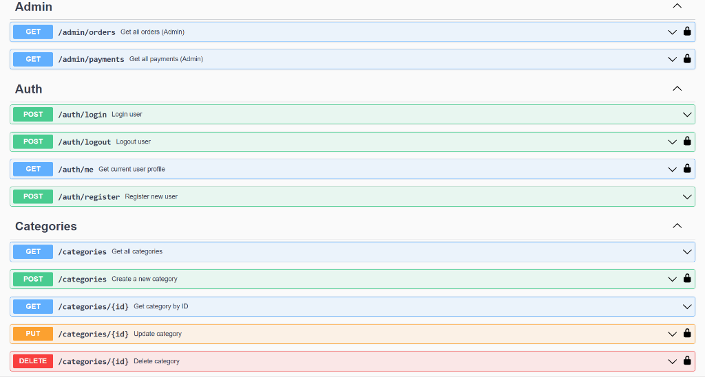
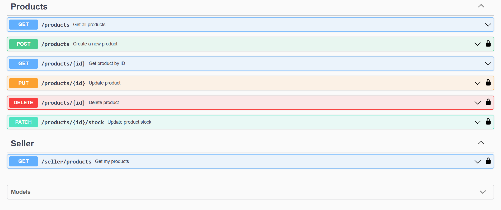

# Go-Commerce API

Backend E-Commerce REST API built with Golang (Gin) using **Modular Monolith** architecture.

## Architecture

This project implements a Modular Monolith pattern - mimicking microservices boundaries while running as a single application. Each business domain is isolated in its own module with dedicated models, repositories, and services.

### Modules

| Module | Description |
|--------|-------------|
| **Auth** | User registration, login, logout, JWT authentication, role management |
| **Product** | Product CRUD, categories, stock management |
| **Order** | Checkout, price calculation, order history |
| **Payment** | Payment simulation with async processing (Goroutines) |

## Tech Stack

- **Language:** Go 1.21+
- **Framework:** Gin Web Framework
- **Database:** PostgreSQL
- **ORM:** GORM v2
- **Caching:** Redis (Token Blacklist)
- **Authentication:** JWT (HMAC/RSA)
- **Logging:** Zerolog (structured logging)
- **Validation:** go-playground/validator with custom validators
- **Testing:** testify/assert + testify/mock
- **Documentation:** Swagger (swaggo)
- **Infrastructure:** Docker & Docker Compose

## Getting Started

### Prerequisites

- Go 1.21+
- Docker & Docker Compose (recommended)
- PostgreSQL (if running without Docker)
- Redis (if running without Docker)

### Quick Start with Docker

```bash
# Clone repository
git clone https://github.com/akbarwjyy/go-commerce-api.git
cd go-commerce-api

# Start all services
docker-compose up -d

# Check logs
docker-compose logs -f api
```

Services akan berjalan di:
- **API:** http://localhost:8080
- **Swagger:** http://localhost:8080/swagger/index.html
- **PostgreSQL:** localhost:5432
- **Redis:** localhost:6379

### Manual Installation

1. **Clone the repository**
   ```bash
   git clone https://github.com/akbarwjyy/go-commerce-api.git
   cd go-commerce-api
   ```

2. **Setup environment variables**
   ```bash
   cp .env.example .env
   # Edit .env with your database credentials
   ```

3. **Install dependencies**
   ```bash
   go mod tidy
   ```

4. **Run the application**
   ```bash
   go run cmd/api/main.go
   ```

5. **Access Swagger Documentation**
   ```
   http://localhost:8080/swagger/index.html
   ```

## Docker

### Available Commands

```bash
# Start all services
docker-compose up -d

# Start with pgAdmin (database management)
docker-compose --profile tools up -d

# Stop all services
docker-compose down

# View logs
docker-compose logs -f api

# Rebuild after code changes
docker-compose up -d --build
```

## Testing

```bash
# Run all tests
go test ./... -v

# Run with coverage
go test ./... -cover

# Run specific package tests
go test ./internal/auth/service/... -v
```

### Test Coverage

| Package | Tests |
|---------|-------|
| `auth/service` | Entity, DTO, Role validation |
| `product/service` | Entity methods, Stock management |
| `order/service` | Status transitions, Calculations |
| `pkg/validator` | Custom validators |

## API Documentation

### Swagger UI
Interactive API documentation available at:
```
http://localhost:8080/swagger/index.html
```

### Swagger UI Preview






### Endpoints Overview

#### Auth
| Method | Endpoint | Description | Auth |
|--------|----------|-------------|------|
| POST | `/api/v1/auth/register` | Register new user | Public |
| POST | `/api/v1/auth/login` | Login user | Public |
| POST | `/api/v1/auth/logout` | Logout (blacklist token) | Required |
| GET | `/api/v1/auth/me` | Get current user profile | Required |

#### Categories
| Method | Endpoint | Description | Auth |
|--------|----------|-------------|------|
| GET | `/api/v1/categories` | Get all categories | Public |
| GET | `/api/v1/categories/:id` | Get category by ID | Public |
| POST | `/api/v1/categories` | Create category | Admin |
| PUT | `/api/v1/categories/:id` | Update category | Admin |
| DELETE | `/api/v1/categories/:id` | Delete category | Admin |

#### Products
| Method | Endpoint | Description | Auth |
|--------|----------|-------------|------|
| GET | `/api/v1/products` | Get all products | Public |
| GET | `/api/v1/products/:id` | Get product by ID | Public |
| POST | `/api/v1/products` | Create product | Seller |
| PUT | `/api/v1/products/:id` | Update product | Owner |
| DELETE | `/api/v1/products/:id` | Delete product | Owner |
| PATCH | `/api/v1/products/:id/stock` | Update stock | Owner |

#### Orders
| Method | Endpoint | Description | Auth |
|--------|----------|-------------|------|
| POST | `/api/v1/orders/checkout` | Create order | Required |
| GET | `/api/v1/orders` | Get my orders | Required |
| GET | `/api/v1/orders/:id` | Get order by ID | Required |
| PATCH | `/api/v1/orders/:id/status` | Update status | Required |
| POST | `/api/v1/orders/:id/cancel` | Cancel order | Required |

#### Payments
| Method | Endpoint | Description | Auth |
|--------|----------|-------------|------|
| POST | `/api/v1/payments` | Create payment | Required |
| GET | `/api/v1/payments` | Get my payments | Required |
| GET | `/api/v1/payments/:id` | Get payment by ID | Required |

#### Admin
| Method | Endpoint | Description | Auth |
|--------|----------|-------------|------|
| GET | `/api/v1/admin/orders` | Get all orders | Admin |
| GET | `/api/v1/admin/payments` | Get all payments | Admin |

**Legend:** Public (no auth) | Required (authenticated) | Role-based (specific role)

## User Roles

| Role | Description |
|------|-------------|
| `user` | Default role, can browse products and make orders |
| `seller` | Can manage own products |
| `admin` | Full access to all resources |
